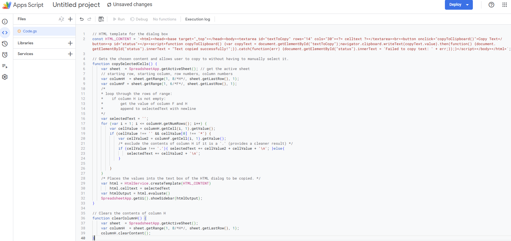

<!-- GitHub Alerts
> [!NOTE]
> Useful information that users should know, even when skimming content.

> [!TIP]
> Helpful advice for doing things better or more easily.

> [!IMPORTANT]
> Key information users need to know to achieve their goal.

> [!WARNING]
> Urgent info that needs immediate user attention to avoid problems.

> [!CAUTION]
> Advises about risks or negative outcomes of certain actions.
> Get-ChildItem -Include desktop.ini -Recurse -Hidden | Remove-Item -Force
-->

# AutoCAD Grading Tools
  


> [!IMPORTANT]
> This project is in no way affiliated or supported by AutoCAD®, Autodesk, or Google.
> This is being made by a high school student[^1] for the purposes of assisting in the grading process of the intro drafting class.

> [!WARNING]
> This project is my first experience with the Lisp language. Expect possibly inefficient or buggy code. This language is weird and parentheses heavy as seen below.
> ```javascript
> // Javascript code
> x = 1 + 2 * 3 // results in x = 7
> ```
> ```lisp
> ; Lisp code
> (setq x (+ 1 (* 2 3))) ; sets x to 7
> ```

###  Google Sheets Macros
> [!NOTE]
> ### Installation Process
> 1. Copy the code from the [file](appscripts/macros.gs)<br><br>
> 2. Open up your google sheet.<br><br>
> 3. Go to `Extensions` `>` `App Scripts`
> <details><summary>Image</summary></details><br><br>
> 
> 4. Replace `Code.gs` with the code you copied from [file](appscripts/macros.gs)
> <details><summary>Image</summary></details><br><br>
> 
> 5. Rename `Code.gs` to `macros.gs` and save (`Ctrl+S`) so that google sheets will register the macros.
> <details><summary>Image</summary></details><br><br>
> 
> 6. Go back to your google sheet and reload the page then go to `Extensions` `>` `Macros` `>` `Import macro` and import each of the macros.
> <details><summary>Image</summary></details><br><br>
> 
> 7. Go to `Extensions` `>` `Macros` `>` `Manage Macros` and set their keybinds as you wish.
> <details><summary>Image</summary></details>
>
> 8. Now that you have the macros installed and setup you are good to work. The `clearColumnH` macro will clear your entries into the `H` column. `copySelectedCells` will take your chosen feedback and comments and set them up in a text box on the sidebar without whitespace. That way you can save yourself the hassle of doing it manually.
> 

> [!TIP]
> ### Keybindings
> Since keybindings are forced to be `Ctrl + Shift + Alt + <number key>` choose a number key that is closer to the left or right like `1`, `2`, `3`, `8`, `9`, or `0`. The keybinds sadly do not work with the numpad keys and there is no workaround that I know of.

###  AutoCAD AutoLISP Apps
> [!NOTE]
> ### Installation Process
> `Incomplete`

###  Versioning
> [!NOTE]
> This project uses $\footnotesize{\textsf{\color{#ffdd00}MAJOR}}$[$\footnotesize{\textsf{\color{#ffdd77}YEAR}}$].$\footnotesize{\textsf{\color{#00ff22}MINOR}}$[$\footnotesize{\textsf{\color{#ddff22}MONTH}}$].$\footnotesize{\textsf{\color{#00aaff}PATCH}}$[$\footnotesize{\textsf{\color{#aaaaff}DAY}}$] for versioning. This makes our first version release v$\footnotesize{\textsf{\color{#ffdd00}1}}$$\footnotesize{\textsf{\color{#ffdd77}25}}$.$\footnotesize{\textsf{\color{#00ff22}0}}$$\footnotesize{\textsf{\color{#ddff22}12}}$.$\footnotesize{\textsf{\color{#00aaff}0}}$$\footnotesize{\textsf{\color{#aaaaff}11}}$ because it is the first major version with no minor changes or patches, and was finished on December 11th, 2025.
> 
> | ${\textsf{\color{#ffdd00}MAJOR}}$ | - Indicates major changes to the fundementals of the codebase. |
> | - | - |
> | ${\textsf{\color{#00ff22}MINOR}}$ | **- Indicates minor changes or new features.** |
> | ${\textsf{\color{#00aaff}PATCH}}$ | **- Indicates bug fixes since previous version.** |
>
> This versioning system is unconventional but I hope that it leads to good communication between developer and user.

[^1]: @TenCommands