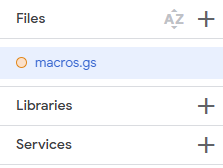
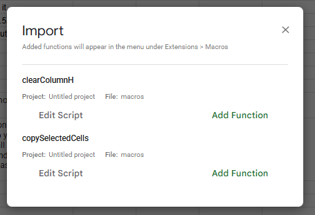
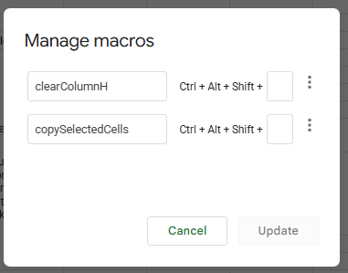

<!-- GitHub Alerts
> [!NOTE]
> Useful information that users should know, even when skimming content.

> [!TIP]
> Helpful advice for doing things better or more easily.

> [!IMPORTANT]
> Key information users need to know to achieve their goal.

> [!WARNING]
> Urgent info that needs immediate user attention to avoid problems.

> [!CAUTION]
> Advises about risks or negative outcomes of certain actions.
> Get-ChildItem -Include desktop.ini -Recurse -Hidden | Remove-Item -Force
-->

# AutoCAD Grading Tools
> [!IMPORTANT]
> This project is in no way affiliated or supported by AutoCAD®, Autodesk, or Google.
> This is being made by a high school student[^1] for the purposes of assisting in the grading process of the intro drafting class.

> [!WARNING]
> This project is my first experience with the Lisp language. Expect possibly inefficient or buggy code. This language is weird and parentheses heavy as seen below.
> ```javascript
> // Javascript code
> x = 1 + 2 * 3 // results in x = 7
> ```
> ```lisp
> ; Lisp code
> (setq x (+ 1 (* 2 3))) ; sets x to 7
> ```

###  Google Sheets Macros
> [!NOTE]
> ### Installation Process
> 1. Copy the code from the [file](appscripts/macros.gs)<br><br>
> 2. Open up your google sheet.<br><br>
> 3. Go to `Extensions` `>` `App Scripts`
> <details><summary>Image</summary></details><br><br>
> 
> 4. Replace `Code.gs` with the code you copied from [file](appscripts/macros.gs)
> <details><summary>Image</summary></details><br><br>
> 
> 5. Rename `Code.gs` to `macros.gs` and save (`Ctrl+S`) so that google sheets will register the macros.
> <details><summary>Image</summary></details><br><br>
> 
> 6. Reload your google sheet and go to `Extensions` `>` `Macros` `>` `Import macro` and import each of the macros.
> <details><summary>Image</summary></details><br><br>
> 
> 7. Go to `Extensions` `>` `Macros` `>` `Manage Macros` and set their keybinds as you wish.
> <details><summary>Image</summary></details>

> [!TIP]
> ### Keybindings
> Since keybindings are forced to be `Ctrl + Shift + Alt + <number key>` choose a number key that is closer to the left like `1`, `2`, or `3`.

###  AutoCAD AutoLISP Apps
> [!NOTE]
> ### Installation Process
> `Incomplete`

###  Versioning
> [!NOTE]
> This project uses `MAJOR[YEAR].MINOR[MONTH].PATCH[DAY]` for versioning. This makes our first version release `v125.012.011`.
> 
> | ${\color{#ffdd00}Major}$ | - Indicates major changes to the fundementals of the codebase. |
> | - | - |
> | ${\color{#00ff22}Minor}$ | **- Indicates minor changes or new features.** |
> | ${\color{#00aaff}Patch}$ | **- Indicates bug fixes since previous version.** |
>
> This versioning system is unconventional but I hope that it leads to good communication between developer and user.

[^1]: @TenCommands